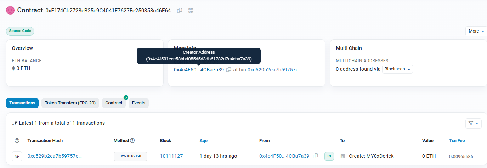
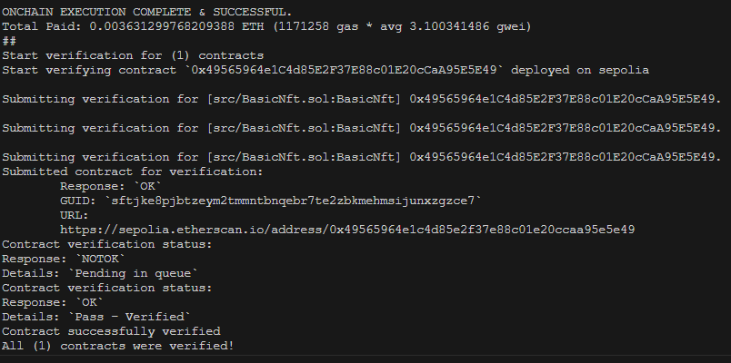
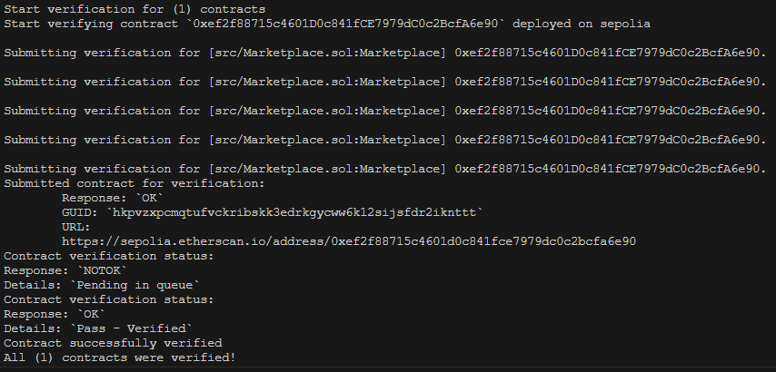

## Personal Profile

**Github:** https://github.com/DerickIT

**Wechat ID:** 0xDerick
**Wechat Name:** 0xDerick

**Discord ID:** Derick#9384

**WalletAddress:** `0x4c4F501eeC58bBD055D5D3dB61782d7c4CBa7a39` `

- Hi, I'm **0xDerick**, formerly a web2 backend architect, now interested in web3 and always believing that decentralization is the future. Many social problems can be improved through blockchain smart contracts, which will make the world a better place.
- In addition, I am an open source enthusiast and hope to join the web3 community to contribute my own strength and buidl together.

my person blog: [blog.ithuo](https://blog.ithuo.net)

### Course task

1. ***use hardhat develop erc20 deploy in goerli test chain example***
 - [Check it on goerli](https://goerli.etherscan.io/address/0xf174cb2728eb25c9c4041f7627fe250358c46e64)

2. ***use foundry develop erc721 deploy in sepolia test chain example***
- [Check it on sepolia](https://sepolia.etherscan.io/address/0x49565964e1c4d85e2f37e88c01e20ccaa95e5e49)

3. ***use foundry develop erc1155 deploy in sepolia test chain example***
- [Check it on sepolia]( https://sepolia.etherscan.io/address/0xef2f88715c4601d0c841fce7979dc0c2bcfa6e90)

