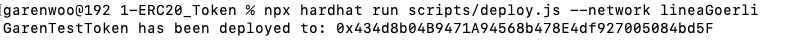
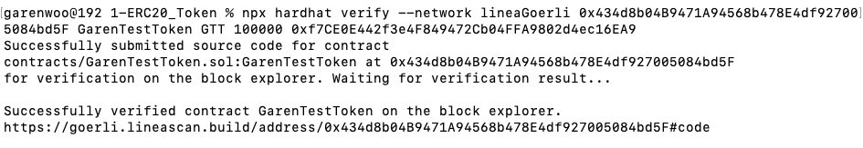
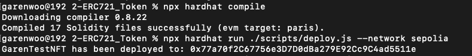
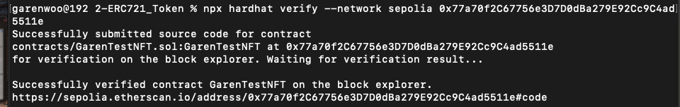
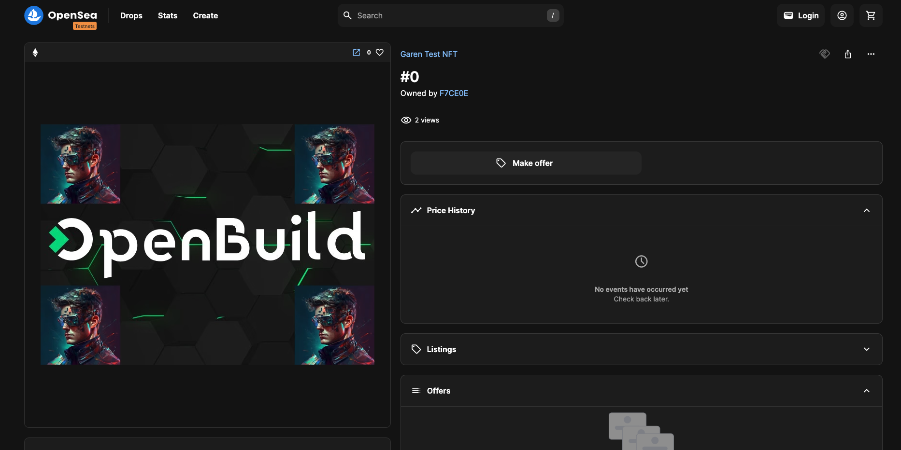

# 通关任务（作业）

### 阶段一

#### 任务 1 - 区块链开发例子-部署一个ERC20代币

1. 选择区块链
   - Chainlist.org (RPC 配置）
   - 浏览器，gas代币（水龙头）
   - [Meter 简介](https://docs.meter.io/developer-documentation/introduction)
   - 代币合约 [Github](https://github.com/meterio/tokenERC20)
2. 合约常用开发环境
   - Node.js
   - npm
   - Hardhat

**作业提交：**

**Network:** 
Linea Goerli Testnet

**Contract Address:** 
https://goerli.lineascan.build/address/0x434d8b04B9471A94568b478E4df927005084bd5F

**Deployment:**

**Verification:**

**Hardhat 工程文件详见 [./phase1/1-ERC20_Token](./phase1/1-ERC20_Token) 。**

#### 任务 2 - 发行一个ERC721的NFT合约

1. 在 sepolia 或其他测试网络发行一个 ERC721 的 NFT 合约，可以参照 https://solidity-by-example.org/app/erc721/
2. 或使用 https://docs.openzeppelin.com/contracts/5.x/erc721，提交合约地址与对应网络

**作业提交：**

**Network:** 
Ethereal Sepolia Testnet

**Contract Address:** 
https://sepolia.etherscan.io/address/0x77a70f2C67756e3D7D0dBa279E92Cc9C4ad5511e

**Compilation&Deployment:**

**Verification:**

**NFT #0 shown on OpenSea Testnet:**
https://testnets.opensea.io/assets/sepolia/0x77a70f2C67756e3D7D0dBa279E92Cc9C4ad5511e/0

**Hardhat 工程文件详见 [./phase1/2-ERC721_Token](./phase1/2-ERC721_Token) 。**

#### 任务 3 - 使用foundry框架编译和测试

1. 在 solidity 左侧 Applications 中选取 1 个自己感兴趣的应用，使用 foundry 框架进行编译，并编写测试（至少覆盖一个 Success Case 和 Fail Case），提交 github repo 链接
2. [Solidity by Example](https://solidity-by-example.org/)

**作业提交：**

**Foundry 工程代码详见 [./phase1/3-FoundryExample](./phase1/3-FoundryExample) 。**

**Compilation&Verification:**

### 阶段二

#### 任务 1 - 分析 token 并对区块进行安全检测

分析链上 BNB 链上 token 并 Fork 高度26793740的区块进行安全测试 0xddc0cff76bcc0ee14c3e73af630c029fe020f907

**作业提交：**

**Foundry 工程代码详见 [./phase2/1-Security_Analysis](./phase2/1-Security_Analysis) 。**

### 阶段三

### 副本任务 

#### 任务 1 - Demoday Chainlink 赛道活动

1. 报名 Chainlink Hackathon（初步报名无需提交项目）。
2. 报名成功后参与报名抽奖。
3. 在最终的 Demoday 的项目中使用 Chainlink 的服务 。

**作业提交：**

**Garen Woo已报名，邮件截图：**

