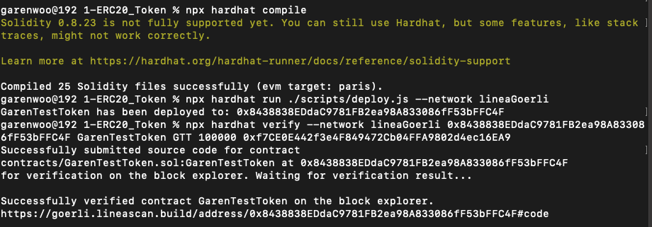
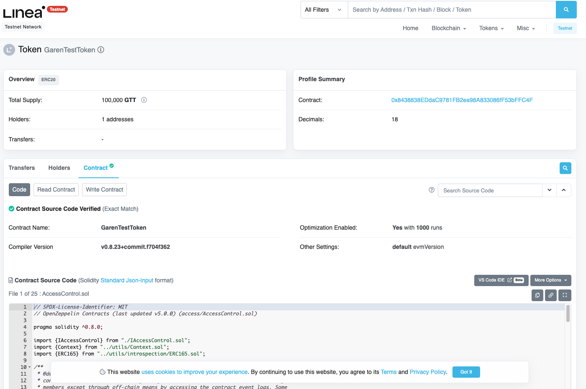
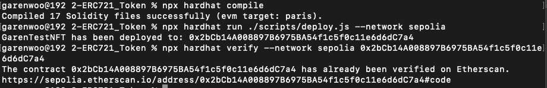
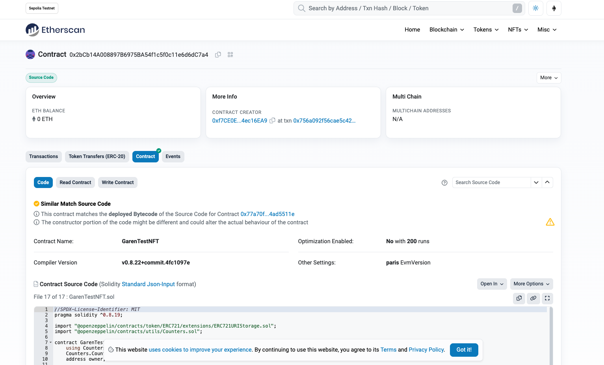
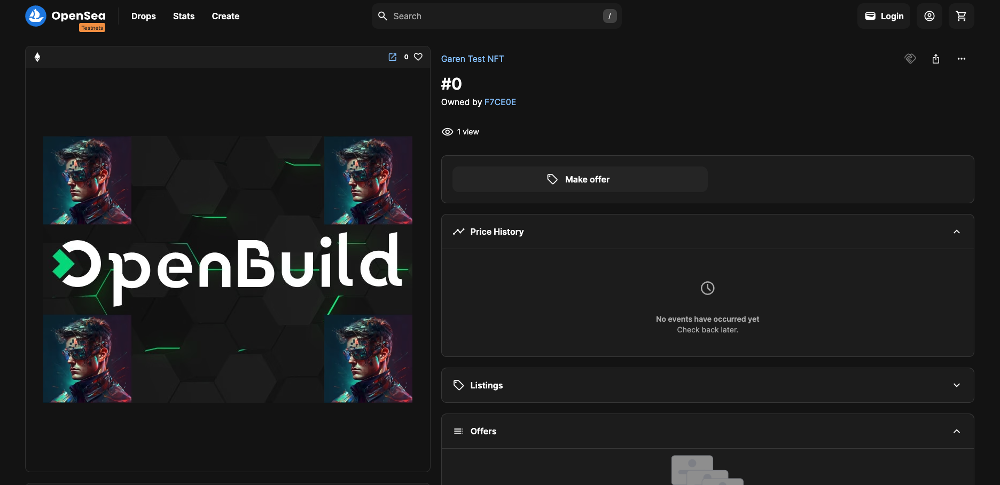
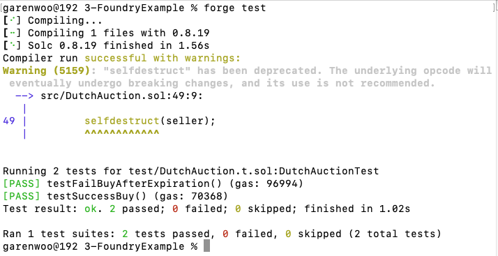
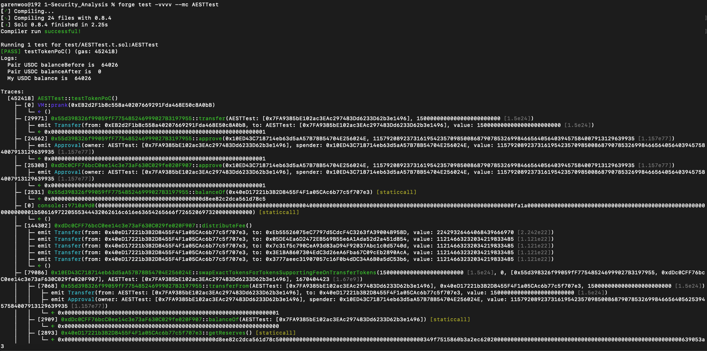
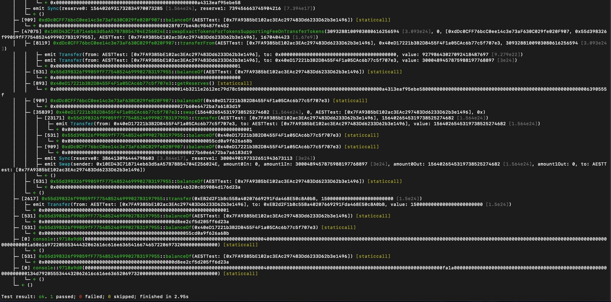
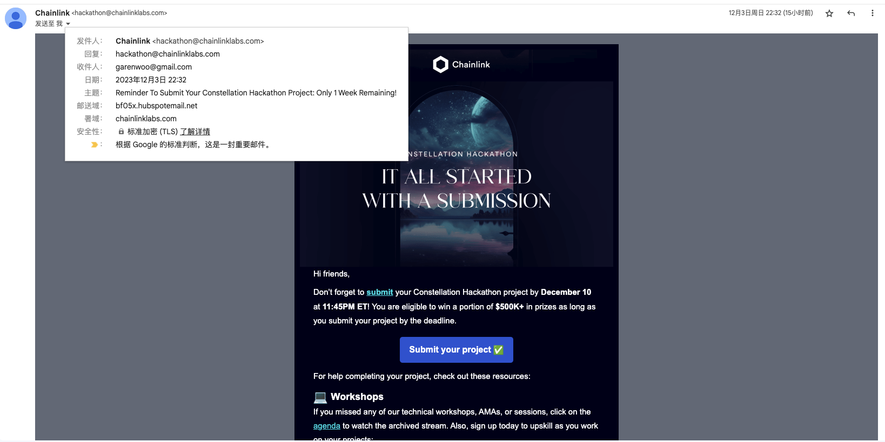

# 通关任务（作业）

### 阶段一

#### 任务 1 - 区块链开发例子-部署一个ERC20代币

1. 选择区块链
   - Chainlist.org (RPC 配置）
   - 浏览器，gas代币（水龙头）
   - [Meter 简介](https://docs.meter.io/developer-documentation/introduction)
   - 代币合约 [Github](https://github.com/meterio/tokenERC20)
2. 合约常用开发环境
   - Node.js
   - npm
   - Hardhat

**作业提交：**

**Network:** 
Linea Goerli Testnet

**Contract Address:** 
https://goerli.lineascan.build/address/0x8438838EDdaC9781FB2ea98A833086fF53bFFC4F

**Compilation, Deployment & Verification:**



**Contract on Etherscan Sepolia Testnet:**



**Hardhat 工程文件详见 [./phase1/1-ERC20_Token](./phase1/1-ERC20_Token) 。**


#### 任务 2 - 发行一个ERC721的NFT合约

1. 在 sepolia 或其他测试网络发行一个 ERC721 的 NFT 合约，可以参照 https://solidity-by-example.org/app/erc721/
2. 或使用 https://docs.openzeppelin.com/contracts/5.x/erc721，提交合约地址与对应网络

**作业提交：**

**Network:** 
Ethereal Sepolia Testnet

**Contract Address:** 
https://sepolia.etherscan.io/address/0x2bCb14A008897B6975BA54f1c5f0c11e6d6dC7a4

**Compilation, Deployment & Verification:**



**Contract on Etherscan Sepolia Testnet:**



**NFT #0 shown on OpenSea Testnet:**

https://testnets.opensea.io/assets/sepolia/0x2bCb14A008897B6975BA54f1c5f0c11e6d6dC7a4/0



**Hardhat 工程文件详见 [./phase1/2-ERC721_Token](./phase1/2-ERC721_Token) 。**


#### 任务 3 - 使用foundry框架编译和测试

1. 在 solidity 左侧 Applications 中选取 1 个自己感兴趣的应用，使用 foundry 框架进行编译，并编写测试（至少覆盖一个 Success Case 和 Fail Case），提交 github repo 链接
2. [Solidity by Example](https://solidity-by-example.org/)

**作业提交：**

**合约文件：**

```solidity
// SPDX-License-Identifier: MIT
pragma solidity ^0.8.19;

interface IERC721 {
    function transferFrom(address _from, address _to, uint _nftId) external;
}

contract DutchAuction {
    uint private constant DURATION = 7 days;

    IERC721 public immutable nft;
    uint public immutable nftId;

    address payable public immutable seller;
    uint public immutable startingPrice;
    uint public immutable startAt;
    uint public immutable expiresAt;
    uint public immutable discountRate;

    constructor(uint _startingPrice, uint _discountRate, address _nft, uint _nftId) {
        seller = payable(msg.sender);
        startingPrice = _startingPrice;
        startAt = block.timestamp;
        expiresAt = block.timestamp + DURATION;
        discountRate = _discountRate;
        require(_startingPrice >= _discountRate * DURATION, "starting price < min");

        nft = IERC721(_nft);
        nftId = _nftId;
    }

    function getPrice() public view returns (uint) {
        uint timeElapsed = block.timestamp - startAt;
        uint discount = discountRate * timeElapsed;
        return startingPrice - discount;
    }

    function buy() external payable {
        require(block.timestamp < expiresAt, "auction expired");

        uint price = getPrice();
        require(msg.value >= price, "ETH < price");

        nft.transferFrom(seller, msg.sender, nftId);
        uint refund = msg.value - price;
        if (refund > 0) {
            payable(msg.sender).transfer(refund);
        }
        selfdestruct(seller);
    }
}

```

**测试用例：**

```solidity
// SPDX-License-Identifier: MIT
pragma solidity ^0.8.19;

import "ds-test/test.sol";
import "../src/DutchAuction.sol";
import "../lib/forge-std/src/Test.sol";
import "../lib/forge-std/test/mocks/MockERC721.t.sol";

contract DutchAuctionTest is DSTest, Test, Token_ERC721 {
    DutchAuction auction;
    Token_ERC721 nft;
    address seller;
    address buyer;

    constructor() Token_ERC721("DutchAuction","DCAN") {

    }

    function setUp() public {
        seller = address(this);
        buyer = address(0x1);
        vm.deal(buyer, 100 ether);
        nft = new Token_ERC721('DutchAuction', 'DCAN');
        nft.mint(seller, 1);
        auction = new DutchAuction(1 ether, 0.000001 ether, address(nft), 1);
    }

    function testSuccessBuy() public {
        nft.approve(address(auction),1);
        uint price = auction.getPrice();
        vm.prank(buyer);
        auction.buy{value: price}();
        assertEq(nft.ownerOf(1), buyer);
    }

    function testFailBuyAfterExpiration() public {
        nft.approve(address(auction), 1);
        uint price = auction.getPrice();
        console.log('block.Timestamp before skip:', block.timestamp);
        skip(1);
        console.log('block.Timestamp after skip:', block.timestamp);
        vm.expectRevert("auction expired");
        vm.prank(buyer);
        auction.buy{value: price}();
    }

    function skip(uint256 time) internal override {
        vm.warp(block.timestamp + time);
    }
}

```

**Compilation & Test:**



**Foundry 工程文件详见 [./phase1/3-FoundryExample](./phase1/3-FoundryExample) 。**


### 阶段二

#### 任务 1 - 分析 token 并对区块进行安全检测

分析链上 BNB 链上 token 并 Fork 高度26793740的区块进行安全测试 0xddc0cff76bcc0ee14c3e73af630c029fe020f907

**作业提交：**






**Foundry 工程代码详见 [./phase2/1-Security_Analysis](./phase2/1-Security_Analysis) 。**


### 阶段三

### 副本任务 

#### 任务 1 - Demoday Chainlink 赛道活动

1. 报名 Chainlink Hackathon（初步报名无需提交项目）。
2. 报名成功后参与报名抽奖。
3. 在最终的 Demoday 的项目中使用 Chainlink 的服务 。

**作业提交：**

**Garen Woo已报名，邮件截图：**

