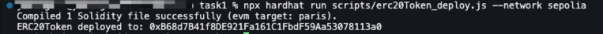
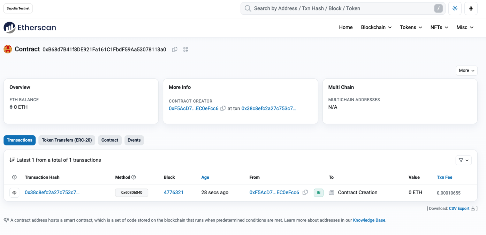
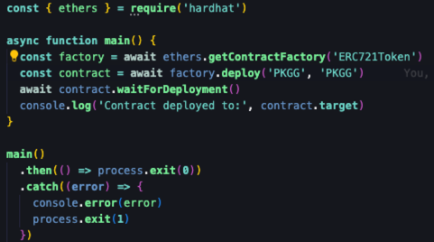
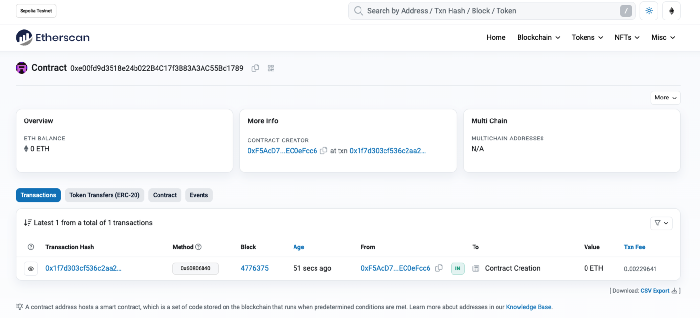
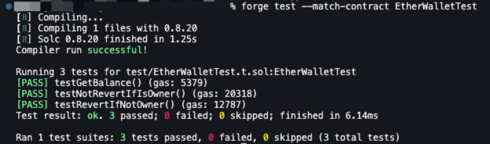
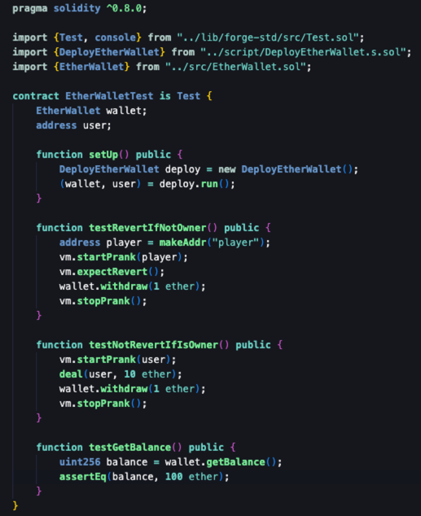
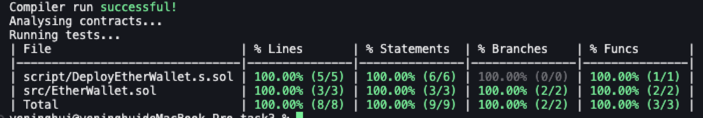

<!---

1. 各位同学复制 `github_id` 文件夹，改名为自己的 github_id

   ```bash
   solidity_bootcamp$ cd members
   solidity_bootcamp/members$ cp -r github_id <Your Own Github_ID>
   ```

2. 自己文件夹内的内容可自由改写，此模板只作为示例
3. 请大家将内容提交到自己的文件夹下，不要改动他人内容
4. 不要删除 `github_id` 这个仓库

--->

# 个人介绍

Github: [https://github.com/PKKRG/solidity_bootcamp](https://github.com/PKKRG/solidity_bootcamp)

Wechat ID: \*\*\*

Discord ID: \*\*\*

钱包地址: 0x475eff90694652E92Dc7a51473D2545e76a5B964

（可以添加个人介绍）

## 作业提交

### T1




### T2




### T3





## 学习日志

[第一课笔记](journal/1.md)
