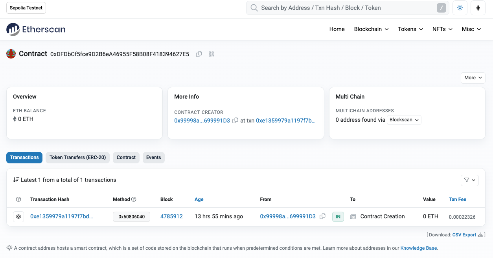

# 任务 2 - 发行一个ERC721的NFT合约

1.  在 sepolia 或其他测试网络发行一个 ERC721 的 NFT 合约，可以参照 https://solidity-by-example.org/app/erc721/
2.  或使用 https://docs.openzeppelin.com/contracts/5.x/erc721，提交合约地址与对应网络


## 合约编写

```js
// SPDX-License-Identifier: MIT
pragma solidity ^0.8.20;

import "@openzeppelin/contracts/token/ERC721/ERC721.sol";
import {ERC721URIStorage} from "@openzeppelin/contracts/token/ERC721/extensions/ERC721URIStorage.sol";

contract ERC721Token is ERC721URIStorage {
    uint256 private _nextTokenId;

    constructor() ERC721("BYMGameItem", "BYMITM") {}

    function awardItem(address player, string memory tokenURI)
        public
        returns (uint256)
    {
        uint256 tokenId = _nextTokenId++;
        _mint(player, tokenId);
        _setTokenURI(tokenId, tokenURI);

        return tokenId;
    }
}
```

## 合约部署

-   **编写部署脚本**：``scripts/deploy.ts`

```js
import { ethers } from "hardhat";

const main = async () => {

  const [deployer] = await ethers.getSigners();
  console.log(`Address deploying the contract --> ${deployer.address}`);

  const tokenFactory = await ethers.getContractFactory("ERC721Token");
  const contract = await tokenFactory.deploy();

  console.log(`Token contract address --> ${contract.address}`);
}

main()
  .then(() => process.exit(0))
  .catch((error) => {
      console.error(error);
      process.exit(1);
  });
```

-   **执行部署命令**

```bash
$ npx hardhat run scripts/deploy-erc721.ts --network sepolia
 Compiled 1 Solidity file successfully (evm target: paris).
 Address deploying the contract --> 0x99998a582E97c3DfADdEAe7e4b197e21699991D3
 Token contract address --> 0xDFDbCf5fce9D2B6eA46955F58B08F418394627E5
```

-   **查看部署结果**

https://sepolia.etherscan.io/address/0xdfdbcf5fce9d2b6ea46955f58b08f418394627e5

