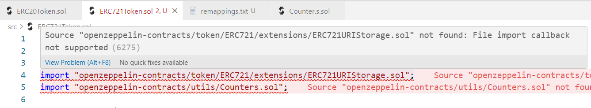

# 任务 3 - 使用foundry框架编译和测试

1. 在 solidity 左侧 Applications 中选取 1 个自己感兴趣的应用，使用 foundry 框架进行编译，并编写测试（至少覆盖一个 Success Case 和 Fail Case），提交 github repo 链接
2. [Solidity by Example](https://solidity-by-example.org/)

## 初始化项目

```bash
$ forge init task03-erc20-foundry
    ......
    Installed forge-std v1.7.3
    Initialized forge project
```

## 依赖安装

> 为了使用`"openzeppelin-contracts/utils/Counters.sol";`采用了老版本

```bash
$ forge install OpenZeppelin/openzeppelin-contracts@v4.9.3
Installing openzeppelin-contracts in /root/task03-erc20-foundry/lib/openzeppelin-contracts (url: Some("https://github.com/OpenZeppelin/openzeppelin-contracts"), tag: None)
	......
    Installed openzeppelin-contracts v5.0.0
```

> 安装后，vscode会报错：
>
> ```
> Source "openzeppelin-contracts/utils/Counters.sol" not found: File import callback not supported
> ```
>
> 
>
> 通过执行该命令解决：
>
> ```bash
> $ forge remappings > remappings.txt
> 
> $ cat remappings.txt 
> @openzeppelin/contracts/=lib/openzeppelin-contracts/contracts/
> ds-test/=lib/forge-std/lib/ds-test/src/
> erc4626-tests/=lib/openzeppelin-contracts/lib/erc4626-tests/
> forge-std/=lib/forge-std/src/
> openzeppelin-contracts/=lib/openzeppelin-contracts/
> ```

## 合约开发

```js
// SPDX-License-Identifier: MIT
pragma solidity ^0.8.20;

import "@openzeppelin/contracts/utils/Counters.sol";
import "@openzeppelin/contracts/token/ERC721/extensions/ERC721URIStorage.sol";

contract ERC721Token is ERC721URIStorage {
    using Counters for Counters.Counter;
    Counters.Counter private _tokenId;

    constructor() ERC721("RZXToken", "RZX") {}

    function mint(
        address deployer,
        string memory tokenUri
    ) external returns (uint256) {
        uint256 newTokenId = _tokenId.current();

        _mint(deployer, newTokenId);
        _setTokenURI(newTokenId, tokenUri);

        _tokenId.increment();

        return newTokenId;
    }

    function setTokenURI(uint256 tokenId, string memory tokenUri) external {
        _setTokenURI(tokenId, tokenUri);
    }

    function msgSender() external view returns (address) {
        return _msgSender();
    }
}
```

## 单元测试

```js
// SPDX-License-Identifier: MIT
pragma solidity ^0.8.20;

import "../src/ERC721Token.sol";
import "forge-std/Test.sol";
import "forge-std/StdCheats.sol";

contract ERC721TokenTest is StdCheats, Test {
    ERC721Token public myERC721;
    address public deployer;
    address public alice = address(0x123);
    address public bob = address(0x456);

    event Log(address);

    function setUp() public {
        deployer = msg.sender;
        myERC721 = new ERC721Token();
        // deployer = myERC721.msgSender();
    }

    function testMint() public {
        string memory tokenURI = "https://erc721/token/1";
        uint256 tokenId = myERC721.mint(deployer, tokenURI);

        assertEq(tokenId, 0);
        assertEq(myERC721.ownerOf(tokenId), deployer);
        assertEq(myERC721.balanceOf(deployer), 1);
        assertEq(myERC721.tokenURI(tokenId), tokenURI);
    }

    function testSetTokenURI() public {
        string memory tokenURI = "https://erc721/token/1";
        uint256 tokenId = myERC721.mint(deployer, tokenURI);

        string memory newTokenURI = "https://erc721/token/2";
        myERC721.setTokenURI(tokenId, newTokenURI);
        assertEq(myERC721.tokenURI(tokenId), newTokenURI);
    }

    function testTransfer() public {
        string memory tokenURI = "https://erc721/token/1";

        vm.startPrank(deployer);
        uint256 tokenId = myERC721.mint(deployer, tokenURI);
        assertEq(myERC721.ownerOf(tokenId), deployer);

        emit Log(deployer);
        emit Log(myERC721.msgSender());
        myERC721.transferFrom(deployer, alice, tokenId);
        assertEq(myERC721.ownerOf(tokenId), alice);
        assertEq(myERC721.balanceOf(deployer), 0);
        assertEq(myERC721.balanceOf(alice), 1);
        vm.stopPrank();
    }

    function testTransferRevertsOnNonOwner() public {
        string memory tokenURI = "https://erc721/token/1";
        uint256 tokenId = myERC721.mint(deployer, tokenURI);

        vm.expectRevert();
        myERC721.transferFrom(alice, bob, tokenId);
    }

    function testApprove() public {
        string memory tokenURI = "https://erc721/token/1";
        vm.startPrank(deployer);
        uint256 tokenId = myERC721.mint(deployer, tokenURI);

        myERC721.approve(alice, tokenId);
        assertEq(myERC721.getApproved(tokenId), alice);
        vm.stopPrank();
    }

    function testTransferFromWithApproval() public {
        string memory tokenURI = "https://erc721/token/1";

        vm.startPrank(deployer);
        uint256 tokenId = myERC721.mint(deployer, tokenURI);
        myERC721.approve(alice, tokenId);
        vm.stopPrank();

        vm.prank(alice);
        myERC721.transferFrom(deployer, bob, tokenId);

        assertEq(myERC721.ownerOf(tokenId), bob);
        assertEq(myERC721.balanceOf(deployer), 0);
        assertEq(myERC721.balanceOf(bob), 1);
    }

    function testSafeTransferFrom() public {
        string memory tokenURI = "https://erc721/token/1";

        vm.startPrank(deployer);
        uint256 tokenId = myERC721.mint(deployer, tokenURI);
        myERC721.safeTransferFrom(deployer, alice, tokenId);
        vm.stopPrank();

        assertEq(myERC721.ownerOf(tokenId), alice);
        assertEq(myERC721.balanceOf(deployer), 0);
        assertEq(myERC721.balanceOf(alice), 1);
    }
}

```

**执行结果：**

```bash
$ forge test -vvv
[⠢] Compiling...
[⠘] Compiling 1 files with 0.8.23
[⠃] Solc 0.8.23 finished in 1.50s
Compiler run successful!

Running 7 tests for test/ERC721Token.t.sol:ERC721TokenTest
[PASS] testApprove() (gas: 134126)
[PASS] testMint() (gas: 107450)
[PASS] testSafeTransferFrom() (gas: 122878)
[PASS] testSetTokenURI() (gas: 108309)
[PASS] testTransfer() (gas: 124453)
[PASS] testTransferFromWithApproval() (gas: 130968)
[PASS] testTransferRevertsOnNonOwner() (gas: 114943)
Test result: ok. 7 passed; 0 failed; 0 skipped; finished in 1.58ms
 
Ran 1 test suites: 7 tests passed, 0 failed, 0 skipped (7 total tests)
```


