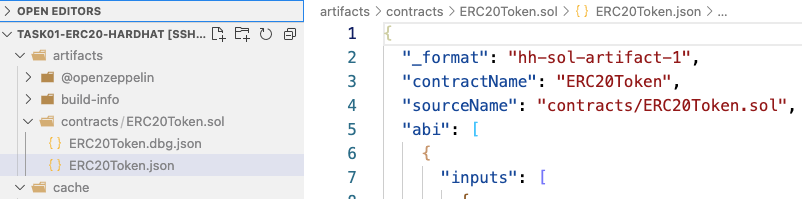
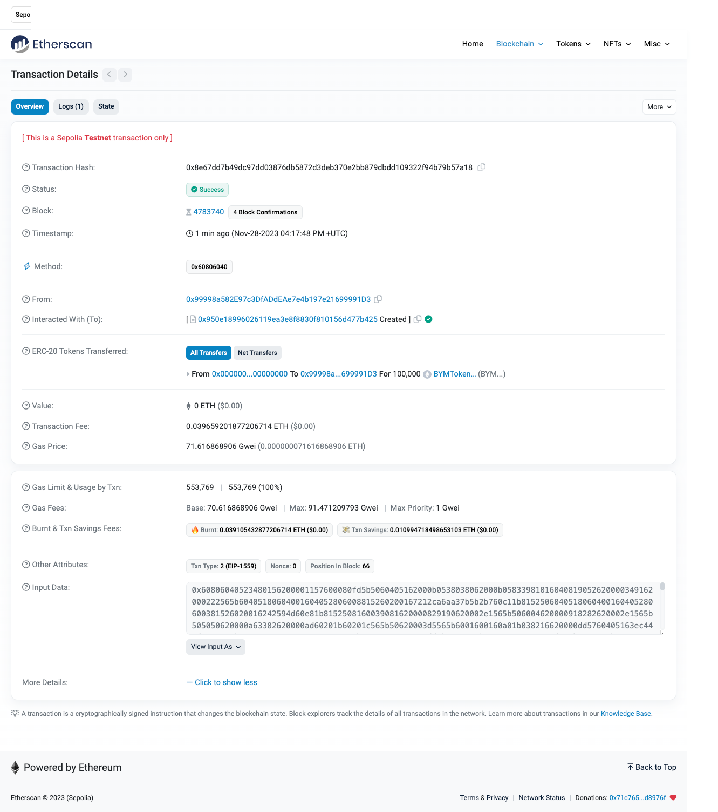
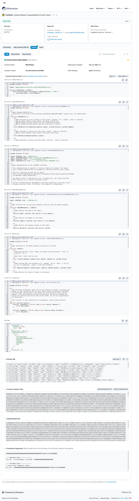

# 任务 1 - 区块链开发例子-部署一个ERC20代币

1. 选择区块链
   - Chainlist.org (RPC 配置）
   - 浏览器，gas代币（水龙头）
   - [Meter 简介](https://docs.meter.io/developer-documentation/introduction)
   - 代币合约 [Github](https://github.com/meterio/tokenERC20)
2. 合约常用开发环境
   - Node.js
   - npm
   - Hardhat

## 1 工程创建

```bash
$ npm init --yes 
$ npm install --save-dev hardhat@2.19.0
$ npx hardhat init
$ npm install --save-dev ethers chai @openzeppelin/contracts dotenv
```

## 2 合约编写

```js
# contracts/ERC20Token.sol

// SPDX-License-Identifier: MIT
pragma solidity 0.8.20;

import "@openzeppelin/contracts/token/ERC20/ERC20.sol";

contract Token is ERC20 {
    constructor(uint256 initialSupply) ERC20("BYMToken", "BYM") {
        _mint(msg.sender, initialSupply);
    }
}
```

## 3 合约编译

> 注：`hardhat.config.ts`中的solidity版本要跟插件配置中的版本一致：`solidity.compileUsingRemoteVersion`
```bash
$ npx hardhat compile
Generating typings for: 8 artifacts in dir: typechain-types for target: ethers-v6
Successfully generated 34 typings!
Compiled 6 Solidity files successfully (evm target: paris).
```

编译好的合约在：



## 4 合约部署

-   **编写部署脚本**：``scripts/deploy.ts`

```js
import { ethers } from "hardhat";

const main = async () => {
  const initialSupply = ethers.utils.parseEther("100000");

  const [deployer] = await ethers.getSigners();
  console.log(`Address deploying the contract --> ${deployer.address}`);

  const tokenFactory = await ethers.getContractFactory("ERC20Token");
  const contract = await tokenFactory.deploy(initialSupply);

  console.log(`Token contract address --> ${contract.address}`);
}

main()
  .then(() => process.exit(0))
  .catch((error) => {
      console.error(error);
      process.exit(1);
  });
```

-   **执行部署命令**

```bash
$ npx hardhat run scripts/deploy.ts --network sepolia
Address deploying the contract --> 0x99998a582E97c3DfADdEAe7e4b197e21699991D3
Token contract address --> 0x950e18996026119ea3e8F8830F810156D477B425
```

-   **查看部署结果**

https://sepolia.etherscan.io/tx/0x8e67dd7b49dc97dd03876db5872d3deb370e2bb879dbdd109322f94b79b57a18



## 5 合约验证

```bash
$ npx hardhat verify --network sepolia --contract contracts/ERC20Token.sol:ERC20Token 0x950e18996026119ea3e8F8830F810156D477B425 100000000000000000000000
Nothing to compile
No need to generate any newer typings.
Successfully submitted source code for contract
contracts/ERC20Token.sol:ERC20Token at 0x950e18996026119ea3e8F8830F810156D477B425
for verification on the block explorer. Waiting for verification result...

Successfully verified contract ERC20Token on Etherscan.
https://sepolia.etherscan.io/address/0x950e18996026119ea3e8F8830F810156D477B425#code
```

合约已验证：


