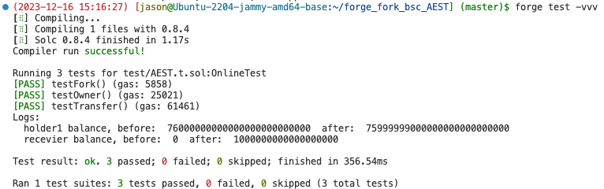

分析链上BNB链上token并Fork高度26793740的区块进行安全测试 0xddc0cff76bcc0ee14c3e73af630c029fe020f907

## 编写测试代码

```js
// SPDX-License-Identifier: MIT
pragma solidity ^0.8.0;

import "forge-std/Test.sol";
import "../src/AEST.sol";

contract OnlineTest is Test {
    AEST token;
    uint256 bscFork;

    address payable target = payable(0xdDc0CFF76bcC0ee14c3e73aF630C029fe020F907);

    address owner = 0x7c64e03e0A4Ed9C19f1ab8B85b8e10eA59BBd150; //developer
    address recevier = 0x99998a582E97c3DfADdEAe7e4b197e21699991D3;
    address holder1 = 0x790fF2BdC2591AF87e656febc6FfdF2D9b2F48e1;

    function setUp() public {
        bscFork = vm.createFork(
            "https://binance.llamarpc.com",
            // 26793740);  // setup failed: Could not instantiate forked environment with fork url
            34407710);

        token = AEST(target);
    }

    function testFork() public {
        vm.selectFork(bscFork);
        assertEq(vm.activeFork(), bscFork);
        // assertEq(block.number, 26793740);
        assertEq(block.number, 34407710);
    }

    function testOwner() public {
        vm.selectFork(bscFork);
        AEST aest  = AEST(target);
        assertEq(owner, aest.owner());
        vm.prank(owner);
        aest.transferOwnership(recevier);
        assertEq(recevier, aest.owner());
    }

    function testTransfer() public {
        vm.selectFork(bscFork);
        AEST aest  = AEST(target);

        uint256 balance1_before = aest.balanceOf(holder1);
        uint256 balance2_before = aest.balanceOf(recevier);

        vm.prank(holder1);
        aest.transfer(recevier, 1e18);

        uint256 balance1_after = aest.balanceOf(holder1);
        uint256 balance2_after = aest.balanceOf(recevier);
        console2.log("holder1 balance, before: ",balance1_before," after: ",balance1_after);
        console2.log("recevier balance, before: ",balance2_before," after: ",balance2_after);
        assertEq(balance1_after, balance1_before - 1e18);
        assertEq(balance2_after, balance2_before + 1e18);
    }
}
```

## 执行单元测试


