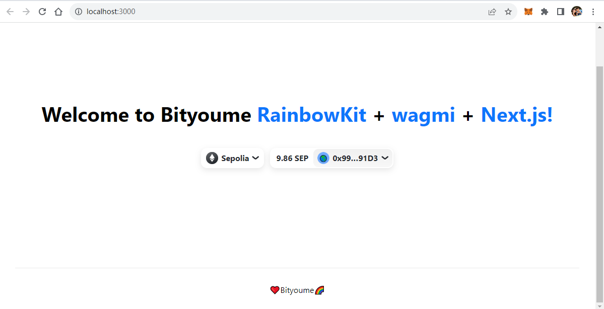

# 任务2.2：自定义编写一个钱包 UI

查看wagmi文档和rainbow源码，根据官方例子自定义编写一个钱包 UI

## 创建一个新的RainbowKit+ [wagmi](https://wagmi.sh/) + [Next.js](https://nextjs.org/)应用脚手架

```
$ pnpm create @rainbow-me/rainbowkit@latest
.../share/pnpm/store/v3/tmp/dlx-736715   |  +71 +++++++
.../share/pnpm/store/v3/tmp/dlx-736715   | Progress: resolved 71, reused 46, downloaded 25, added 71, done

🌈 Welcome to RainbowKit!

✔ What is the name of your project? … js-rainbowkit-app

🚀 Creating a new RainbowKit app in /root/Study/JasonPlayBlockchain/06.Ethereum/js-rainbowkit-app
📦 Installing dependencies with pnpm. This could take a while.
Downloading registry.npmjs.org/next/13.5.6: 17.52 MB/17.52 MB, done
Downloading registry.npmjs.org/@next/swc-linux-x64-gnu/13.5.6: 38.18 MB/38.18 MB, done
Downloading registry.npmjs.org/@next/swc-linux-x64-musl/13.5.6: 44.50 MB/44.50 MB, done
Packages: +577
+++++++++++++++++++++++++++++++++++++++++++++++++++++++++++++++++++++++++++++++++++++++++++++++++++++++++++++++++++++++++++++++++++++++++++++++++++++++++++++++++++++++++++++++++++++++++++++++++++++++++++++++++++++++++++++++++++++++++++++++++++++++++++++++++++++++++++++++++++++++++++++++
Progress: resolved 595, reused 567, downloaded 10, added 577, done
node_modules/.pnpm/bigint-buffer@1.1.5/node_modules/bigint-buffer: Running install script, done in 563ms
node_modules/.pnpm/utf-8-validate@5.0.10/node_modules/utf-8-validate: Running install script, done in 119ms
node_modules/.pnpm/bufferutil@4.0.8/node_modules/bufferutil: Running install script, done in 140ms
node_modules/.pnpm/keccak@3.0.4/node_modules/keccak: Running install script, done in 101ms

dependencies:
+ next 13.5.6 (14.0.4 is available)
+ react 18.2.0
+ react-dom 18.2.0
+ viem 1.19.15 (1.20.0 is available)
+ wagmi 1.4.12

devDependencies:
+ @types/node 18.19.3 (20.10.4 is available)
+ @types/react 18.2.45
+ eslint 8.55.0
+ eslint-config-next 13.5.6 (14.0.4 is available)
+ typescript 5.3.3

Done in 14.9s
Packages: +29
+++++++++++++++++++++++++++++
Progress: resolved 624, reused 605, downloaded 1, added 29, done

dependencies:
+ @rainbow-me/rainbowkit 1.3.1

Done in 4.7s
📚 Initializing git repository
🌈 Done! Thanks for using RainbowKit 🙏

👉 To get started, run cd js-rainbowkit-app and then pnpm dev
```

## 代码修改

### pages/_app.tsx

```js
import '../styles/globals.css';
import '@rainbow-me/rainbowkit/styles.css';
import { getDefaultWallets, RainbowKitProvider } from '@rainbow-me/rainbowkit';
import type { AppProps } from 'next/app';
import { configureChains, createConfig, WagmiConfig } from 'wagmi';
import {
  mainnet,
  sepolia,
} from 'wagmi/chains';
import { publicProvider } from 'wagmi/providers/public';

const { chains, publicClient, webSocketPublicClient } = configureChains(
  [
    mainnet,
    sepolia,
    // ...(process.env.NEXT_PUBLIC_ENABLE_TESTNETS === 'true' ? [goerli] : []),
  ],
  [publicProvider()]
);

const { connectors } = getDefaultWallets({
  appName: 'Jason RainbowKit App',
  projectId: 'Bityoume',
  chains,
});

const wagmiConfig = createConfig({
  autoConnect: true,
  connectors,
  publicClient,
  webSocketPublicClient,
});

function MyApp({ Component, pageProps }: AppProps) {
  return (
    <WagmiConfig config={wagmiConfig}>
      <RainbowKitProvider chains={chains}>
        <Component {...pageProps} />
      </RainbowKitProvider>
    </WagmiConfig >
  );
}

export default MyApp;
```

### pages/index.tsx

```js
import { ConnectButton } from '@rainbow-me/rainbowkit';
import type { NextPage } from 'next';
import Head from 'next/head';
import styles from '../styles/Home.module.css';

const Home: NextPage = () => {
  return (
    <div className={styles.container}>
      <Head>
        <title>RainbowKit App</title>
        <meta
          content="Generated by @rainbow-me/create-rainbowkit"
          name="description"
        />
        <link href="/favicon.ico" rel="icon" />
      </Head>

      <main className={styles.main}>
        <h1 className={styles.title}>
          Welcome to Bityoume <a href="">RainbowKit</a> + <a href="">wagmi</a> +{' '}
          <a href="https://nextjs.org">Next.js!</a>
        </h1>
        <ConnectButton />
      </main>

      <footer className={styles.footer}>
        ❤️Bityoume🌈
      </footer>
    </div>
  );
};

export default Home;
```

## 启动

```bash
$ yarn dev
```

## 效果展示

