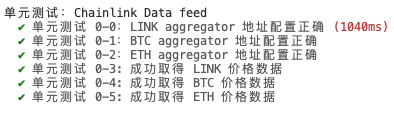
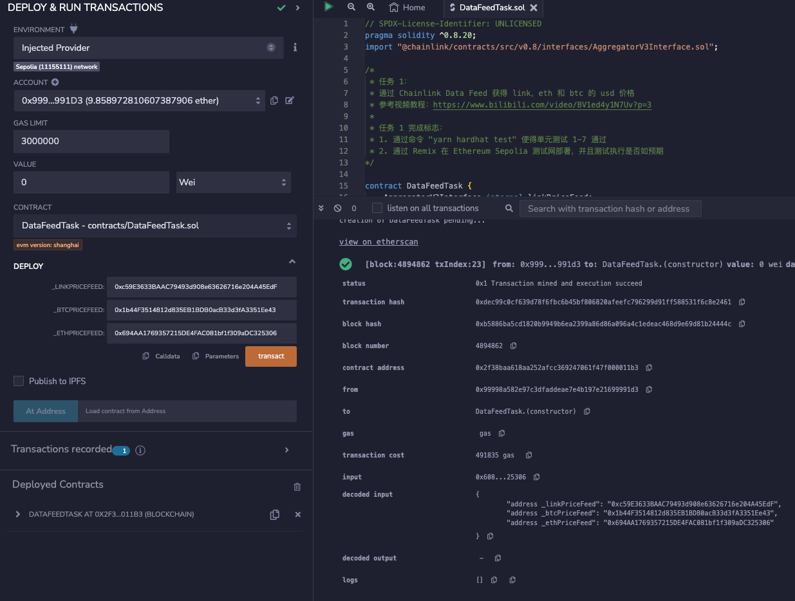
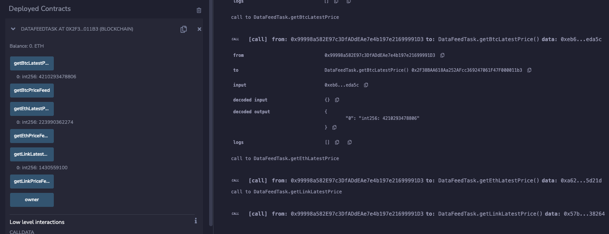
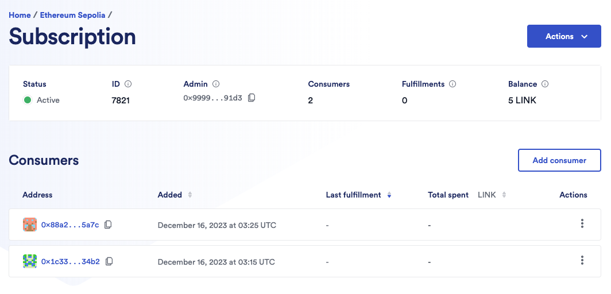
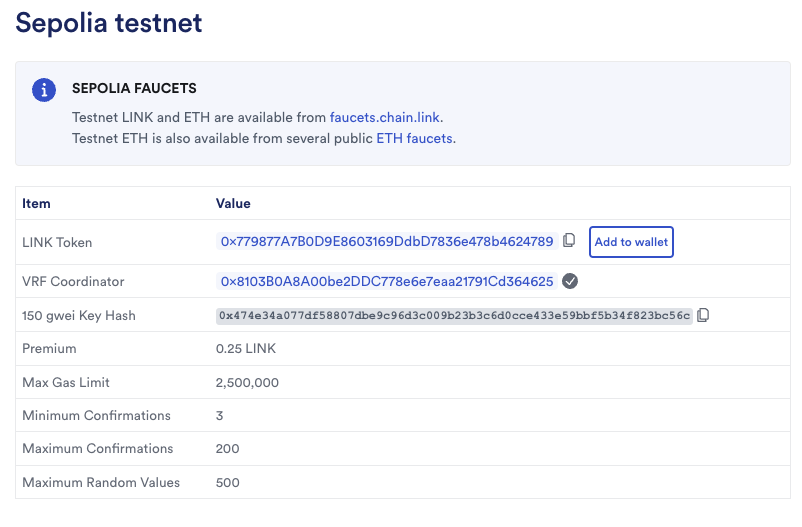
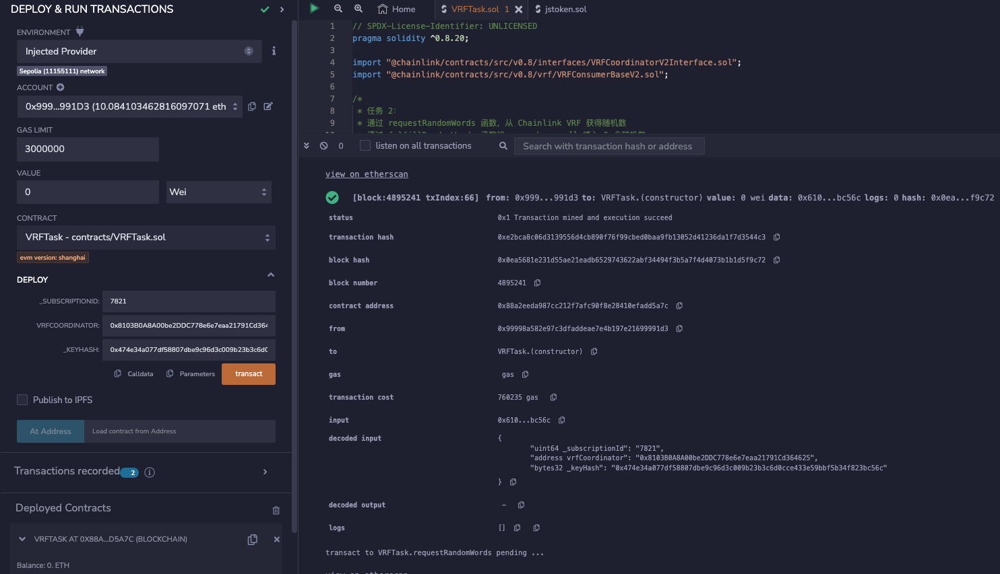
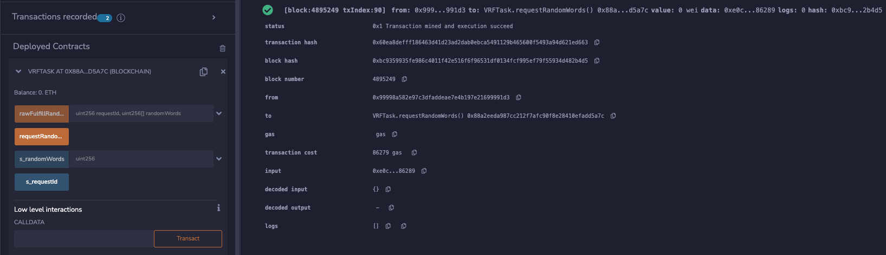

# 任务3：终极任务🐉

完成 [ChainlinkLearningPath](https://github.com/QingyangKong/ChainlinkLearningPath "https://github.com/QingyangKong/ChainlinkLearningPath") 中全部的三个任务

## 3.1 - Chainlink Data Feed

1.  学习[下述学习资料](https://github.com/bityoume/ChainlinkLearningPathByJS#学习资料)中的 Chainlink Data Feed（喂价）部分内容。
2.  完成 [contracts/DataFeedTask.sol](https://github.com/bityoume/ChainlinkLearningPathByJS/blob/main/contracts/DataFeedTask.sol) 中的任务。

### （1）合约实现

https://github.com/bityoume/ChainlinkLearningPathByJS/blob/main/contracts/DataFeedTask.sol

```js
// SPDX-License-Identifier: UNLICENSED
pragma solidity ^0.8.7;
import "@chainlink/contracts/src/v0.8/interfaces/AggregatorV3Interface.sol";

/*
 * 任务 1：
 * 通过 Chainlink Data Feed 获得 link，eth 和 btc 的 usd 价格
 * 参考视频教程：https://www.bilibili.com/video/BV1ed4y1N7Uv?p=3
 * 
 * 任务 1 完成标志：
 * 1. 通过命令 "yarn hardhat test" 使得单元测试 1-7 通过
 * 2. 通过 Remix 在 Ethereum Sepolia 测试网部署，并且测试执行是否如预期
*/

contract DataFeedTask {
    AggregatorV3Interface internal linkPriceFeed;
    AggregatorV3Interface internal btcPriceFeed;
    AggregatorV3Interface internal ethPriceFeed;
    address public owner;

    modifier onlyOwner {
        require(msg.sender == owner);
        _;
    }

     /**
     * 步骤 1 - 在构造这里初始化 3 个 Aggregator
     * 
     * 注意：
     * 通过 Remix 部署在非本地环境中时
     * 通过 https://docs.chain.link/data-feeds/price-feeds/addresses，获得 Aggregator Sepolia 测试网合约地址
     * 本地环境中相关参数已经在测试脚本中配置
     *  */
    constructor(
        address _linkPriceFeed,
        address _btcPriceFeed,
        address _ethPriceFeed) {
        owner = msg.sender;
        
        //修改以下 solidity 代码
        linkPriceFeed = AggregatorV3Interface(_linkPriceFeed);
        btcPriceFeed = AggregatorV3Interface(_btcPriceFeed);
        ethPriceFeed = AggregatorV3Interface(_ethPriceFeed);
    }

    /**
     * 步骤 2 - 完成 getLinkLatestPrice 函数 
     * 获得 link/usd 的价格数据
     */
    function getLinkLatestPrice() public view returns (int256) {
        //在此添加并且修改 solidity 代码
        int answer;
        ( , answer, , , ) = linkPriceFeed.latestRoundData();
        return answer;
    }

    /**
     * 步骤 3 - 完成 getBtcLatestPrice 函数
     * 获得 btc/usd 的价格数据
     */  
    function getBtcLatestPrice() public view returns (int256) {
        //在此添加并且修改 solidity 代码
        int answer;
        ( , answer, , , ) = btcPriceFeed.latestRoundData();
        return answer;
    }

    /**
     * 步骤 4 - 完成 getEthLatestPrice 函数
     * 获得 eth/usd 的价格数据
     */
    function getEthLatestPrice() public view returns (int256) {
        //在此添加并且修改 solidity 代码
        int answer;
        ( , answer, , , ) = ethPriceFeed.latestRoundData();
        return answer;
    }

    /**
     * 步骤 5 - 通过 Remix 将合约部署合约
     * 
     * 任务成功标志：
     * 合约部署成功
     * 获取 link/usd, btc/usd, eth/usd 价格
     */ 
    
    function getLinkPriceFeed() public view returns (AggregatorV3Interface) {
        return linkPriceFeed;
    }

    function getBtcPriceFeed() public view returns (AggregatorV3Interface) {
        return btcPriceFeed;
    }
 
    function getEthPriceFeed() public view returns (AggregatorV3Interface) {
        return ethPriceFeed;
    }
}
```

### （2）单元测试



### （3）获取Sepolia price feed地址

https://docs.chain.link/data-feeds/price-feeds/addresses

| 交易对     | 地址                                       |
| ---------- | ------------------------------------------ |
| BTC / USD  | 0x1b44F3514812d835EB1BDB0acB33d3fA3351Ee43 |
| ETH / USD  | 0x694AA1769357215DE4FAC081bf1f309aDC325306 |
| LINK / USD | 0xc59E3633BAAC79493d908e63626716e204A45EdF |

### （4）Remix部署合约及验证





## 3.2 - Chainlink VRF

1.  学习[下述学习资料](https://github.com/bityoume/ChainlinkLearningPathByJS#学习资料)的 Chainlink VRF（可验证随机数）部分内容。
2.  完成 [contracts/VRFTask.sol](https://github.com/bityoume/ChainlinkLearningPathByJS/blob/main/contracts/VRFTask.sol) 中的任务。

### （1）合约实现

https://github.com/bityoume/ChainlinkLearningPathByJS/blob/main/contracts/VRFTask.sol

```js
// SPDX-License-Identifier: UNLICENSED
pragma solidity ^0.8.0;

import "@chainlink/contracts/src/v0.8/interfaces/VRFCoordinatorV2Interface.sol";
import "@chainlink/contracts/src/v0.8/vrf/VRFConsumerBaseV2.sol";

/*
 * 任务 2：
 * 通过 requestRandomWords 函数，从 Chainlink VRF 获得随机数
 * 通过 fulfillRandomWords 函数给 s_randomness[] 填入 5 个随机数
 * 保证 5 个随机数为 5 以内，并且不重复
 * 参考视频教程： https://www.bilibili.com/video/BV1ed4y1N7Uv
 * 
 * 任务 2 完成标志：
 * 1. 通过命令 "yarn hardhat test" 使得单元测试 8-10 通过
 * 2. 通过 Remix 在 Ethereum Sepolia 测试网部署，并且测试执行是否如预期
*/


contract VRFTask is VRFConsumerBaseV2 {
    VRFCoordinatorV2Interface immutable COORDINATOR;
    
    /* 
     * 步骤 1 - 获得 VRFCoordinator 合约的地址和所对应的 keyHash
     * 修改变量
     *   CALL_BACK_LIMIT：回调函数最大 gas 数量
     *   REQUEST_CONFIRMATIONS：最小确认区块数
     *   NUM_WORDS：单次申请随机数的数量
     * 
     * 注意：
     * 通过 Remix 部署在非本地环境时，相关参数请查看 
     * https://docs.chain.link/docs/vrf/v2/supported-networks/，获取 keyHash 的指和 vrfCoordinator 的地址
     * 本地环境在测试脚本中已经自动配置
     * 
     */ 

    // Chainlink VRF 在接收到请求后，会通过 fulfillRandomWords 将数据写回到用户合约，此过程需要消耗 gas
    // CALL_BACK_LIMIT 是回调函数可以消耗的最大 gas，根据回调函数的逻辑适当调整 CALL_BACK_LIMIT
    // 详情请查看：https://docs.chain.link/vrf/v2/subscription/examples/get-a-random-number#analyzing-the-contract
    uint32 constant CALL_BACK_LIMIT = 10000000;
    
    // Chainlink VRF 在返回随机数之前应该等待的 Confirmation，值越大，返回的值越安全
    uint16 constant REQUEST_CONFIRMATIONS = 10;

    // Chainlink VRF 在每次请求后返回的随机数数量
    uint32 constant NUM_WORDS = 5;

    // 非本地环境部署，构造函数需要对 s_subscriptionId 和 s_keyHash 赋值（本地测试时不需要配置）
    // s_subscriptionId 是 VRF subscription ID（订阅 ID）
    // 在这里创建并且获得 subscription id https://vrf.chain.link/
    uint64 immutable s_subscriptionId;
    // s_keyHash 是 VRF 的 gas Lane，决定回调时所使用的 gas price
    // 在这里查看  https://docs.chain.link/vrf/v2/subscription/supported-networks
    bytes32 immutable s_keyHash;

    uint256[] public s_randomWords;
    uint256 public s_requestId;

    address s_owner;

    event ReturnedRandomness(uint256[] randomWords);

    modifier onlyOwner {
        require(msg.sender == s_owner);
        _;
    }

    /**  
     * 步骤 2 - 在构造函数中，初始化相关变量
     * COORDINATOR，s_subscriptionId 和 s_keyHash
     * */
    constructor(
        uint64 _subscriptionId,
        address vrfCoordinator,
        bytes32 _keyHash
    ) VRFConsumerBaseV2(vrfCoordinator) {
        s_owner = msg.sender;
        
        //修改以下 solidity 代码
        COORDINATOR = VRFCoordinatorV2Interface(vrfCoordinator);
        s_subscriptionId = _subscriptionId;
        s_keyHash = _keyHash;
    }

    /** 
     * 步骤 3 - 发送随机数请求
     * */ 
    function requestRandomWords() external onlyOwner {
        //在此添加并且修改 solidity 代码
        s_requestId = COORDINATOR.requestRandomWords(
            s_keyHash, s_subscriptionId, REQUEST_CONFIRMATIONS,CALL_BACK_LIMIT, NUM_WORDS);
    }

    /**
     * 步骤 4 - 接受随机数，完成逻辑获取 5 个 5 以内**不重复**的随机数
     * 关于如何使得获取的随机数不重复，清参考以下代码
     * https://gist.github.com/cleanunicorn/d27484a2488e0eecec8ce23a0ad4f20b
     *  */ 
    function fulfillRandomWords(uint256 requestId, uint256[] memory _randomWords)
        internal
        override
    {
        //在此添加 solidity 代码

        s_randomWords = new uint[](NUM_WORDS); 
        
        // Initialize array.
        for (uint i = 0; i < NUM_WORDS; i++) {
           s_randomWords[i] = i + 1;
        }
        
        // Set the last item of the array which will be swapped.
        uint last_item = NUM_WORDS - 1;
        
        // We need to do `size - 1` iterations to completely shuffle the array.
        for (uint i = 1; i < NUM_WORDS - 1; i++) {
            // Set the initial randomness based on the provided entropy.
            bytes32 random = keccak256(abi.encodePacked(_randomWords[i]));
        
            // Select a number based on the randomness.
            uint selected_item = uint(random) % last_item;
            
            // Swap items `selected_item <> last_item`.
            uint aux = s_randomWords[last_item];
            s_randomWords[last_item] = s_randomWords[selected_item];
            s_randomWords[selected_item] = aux;
            
            // Decrease the size of the possible shuffle
            // to preserve the already shuffled items.
            // The already shuffled items are at the end of the array.
            last_item--;
        }

        
        emit ReturnedRandomness(s_randomWords);
    }
}
```


### （2）单元测试


### （3）合约构造参数准备

-   **获取订阅ID**

https://vrf.chain.link/



-   **获取VRF Coordinator & KeyHash**

https://docs.chain.link/vrf/v2/subscription/supported-networks



-   **参数汇总**

| 参数              | 取值                                                         |
| ----------------- | ------------------------------------------------------------ |
| Subscription ID   | 7820                                                         |
| VRF Coordinator   | 0x8103B0A8A00be2DDC778e6e7eaa21791Cd364625                   |
| 150 gwei Key Hash | 0x474e34a077df58807dbe9c96d3c009b23b3c6d0cce433e59bbf5b34f823bc56c |


### （3）Remix部署合约及验证

-   **合约部署**



-   **获取随机数**



- **一直pending，超过10小时，没有回写随机数，不知哪里出了问题？**


## 3.3 - Chainlink Automation

1.  学习[下述学习资料](https://github.com/bityoume/ChainlinkLearningPathByJS#学习资料)中的 Chainlink Automation（合约自动化执行）部分内容。
2.  完成 [contracts/AutomationTask.sol](https://github.com/bityoume/ChainlinkLearningPathByJS/blob/main/contracts/AutomationTask.sol) 中的任务。

**🍺 🍺 完成以上 3 个任务后，请提交用来完成任务的测试网地址，将发送 SBT 证明！ 🍺 🍺**

### （1）合约实现

```js
// SPDX-License-Identifier: UNLICENSED
pragma solidity ^0.8.7;

import "@chainlink/contracts/src/v0.8/automation/AutomationCompatible.sol";

/*
 * 任务 3 内容，试想一个小游戏，数组 health 用于存储 10 个角色的 HP（healthPoint）
 * HP 初始值为 1000，每次攻击（fight）会降低 100。
 * 
 * 同时满足以下两个条件，角色就可以通过 Automation 补充为 1000：
 * 1. 如果生命值不足 1000
 * 2. 经过某个时间间隔 interval
 * 请完成以下代码，实现上述逻辑 
 * 
 * 参考视频教程：https://www.bilibili.com/video/BV1ed4y1N7Uv?p=9
 * 
 * 任务 3 完成标志：
 * 1. 通过命令 "yarn hardhat test" 使得单元测试 11-12 通过
 * 2. 通过 Remix 在 Ethereum Sepolia 测试网部署，并且测试执行是否如预期
 */

contract AutomationTask is AutomationCompatible {
    
    uint256 public constant SIZE = 10;
    uint256 public constant MAXIMUM_HEALTH = 1000;
    uint256[SIZE] public healthPoint;
    uint256 public lastTimeStamp;
    uint256 public immutable interval;

    /*
     * 步骤 1 - 在构造函数中完成数组 healthPoint 的初始化
     */    
    constructor(uint256 _interval) {
        lastTimeStamp = block.timestamp;
        interval = _interval;
        
        //在此添加 solidity 代码
        for(uint i=0; i<SIZE; i++){
            healthPoint[i] = MAXIMUM_HEALTH;
        }
    }

    /*
     * 步骤 2 - 定义 fight 函数
     * 使得用户可以通过 fight 函数改变数组中的生命值
     * fight 函数接收一个参数 fighter，代表数组中的下标
     */
    function fight(uint256 fighter) public {
        //在此添加 solidity 代码
        require(fighter < SIZE, "out of range");
        require(healthPoint[fighter] > 100, "low health");
        healthPoint[fighter] -= 100;
    }

    /* 
     * 步骤 3 - 通过 checkUpKeep 来检测：
     * 1. 数组 healthPoint 中的数值是否小于 1000
     * 2. 是否经过了时间间隔 interval
     * 
     * 注意：
     * 这部分操作将由 Chainlink 预言机节点在链下计算，本地环境中已由脚本配置
     * 可以尝试在 checkUpKeep 函数中改变状态，观察是否会发生改变
     */      
    function checkUpkeep(
        bytes memory /* checkData*/ 
    ) 
        public 
        view 
        override 
        returns (
            bool upkeepNeeded,
            bytes memory performData
        )
    {
        //在此添加和修改 solidity 代码
        upkeepNeeded = false;
        performData = abi.encode("");

        bool intervalPassed = (block.timestamp - lastTimeStamp >= interval);
        if (!intervalPassed){
            return (upkeepNeeded, performData);
        }

        uint counter = 0;
        for(uint i=0; i<SIZE; i++){
            if(healthPoint[i] < 1000){
                counter++;
            }
        }

        if (counter == 0){
            return (upkeepNeeded, performData);
        }

        uint256[] memory indexUpdate = new uint256[](counter);
        uint indexCounter = 0;
        for(uint i=0; i<SIZE; i++){
            if(healthPoint[i] < 1000){
                indexUpdate[indexCounter] = i;
                indexCounter++;
            }
        }

        upkeepNeeded = true;
        performData = abi.encode(indexUpdate);

        return (upkeepNeeded, performData);
    }

    /* 
     * 步骤 4 - 通过 performUpKeep 来完成将补足数组中生命值的操作
     * 例如发现 healthPoint[0] = 500，则将其增加 500 变为 1000
     * 
     * 注意：
     * 可以通过 performData 使用 checkUpkeep 的运算结果，减少 gas 费用
     */
    function performUpkeep(
        bytes memory performData
    ) 
        external 
        override 
    {
        //在此添加 solidity 代码
        if (performData.length == 0){
            return;
        }

        uint256[] memory indexUpdate = abi.decode(performData, (uint256[]));
        uint length = indexUpdate.length;
        for(uint i=0; i<length; i++){
            healthPoint[indexUpdate[i]] = 1000;
        }

        lastTimeStamp = block.timestamp;
    }
}
```


### （2）单元测试


### （3）Remix部署合约及验证

-   **合约部署**


- **注册Upkeep**
https://automation.chain.link/sepolia/new


- **攻击1，变为900**


- **自动触发后，用户回血**
