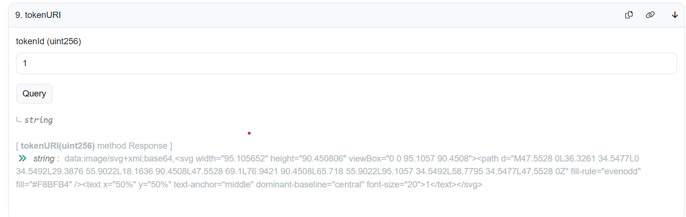

# 学习成果

1. counter contract
- 源码：code/counter
- 部署事务：`https://sepolia.etherscan.io/tx/0xc13cef740b02faeeb1892e1696b01a13fc146ed1afd32fbd40790b60d8b64cea`
- contract:`https://sepolia.etherscan.io/address/0x53410523fc25b9c2dda6f771c860a254de7f2c2d`

2. erc20 contract
- 源码：code/myerc20
- 部署事务：`https://sepolia.etherscan.io/tx/0x1ba6a5bb3e3f806053e314bdd9aa1c0ca8f557dd053acad9916e56858b177870`
- contract:`https://sepolia.etherscan.io/address/0x0ef13dA7DC2f0c19bc0AE0EF8B4471a9dbE781a2`

3. nft contract
- 源码：code/mynft
- 部署事务：`https://sepolia.etherscan.io/tx/0x1c5987b1132de7332b6c5ae8089fb493582a6ec29fdd0177b2a6173ea12ab09b`
- contract:`https://sepolia.etherscan.io/address/0xDd8794BFbeC38563C55D10B1d91a63B9a4982751`
- nft:`https://sepolia.etherscan.io/nft/0xdd8794bfbec38563c55d10b1d91a63b9a4982751/1`
- verify-contracy:`https://sepolia.etherscan.io/address/0xdd8794bfbec38563c55d10b1d91a63b9a4982751#code`
- 