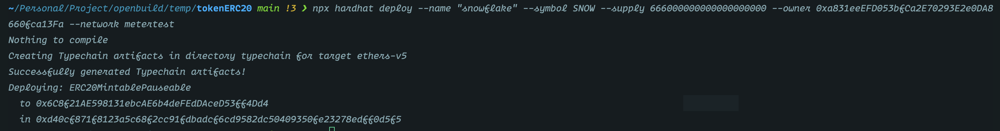
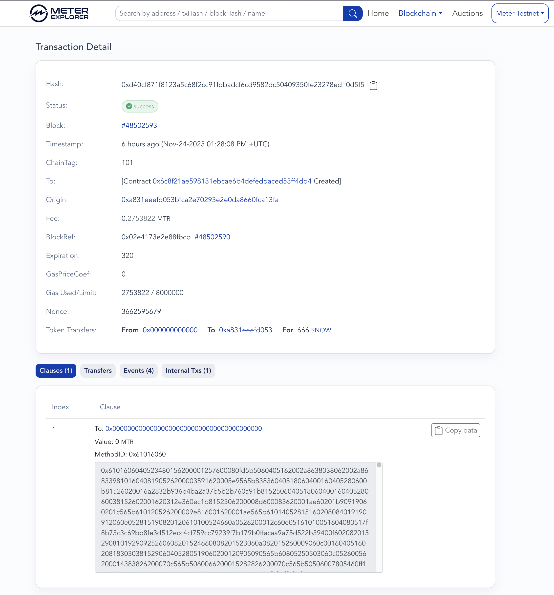
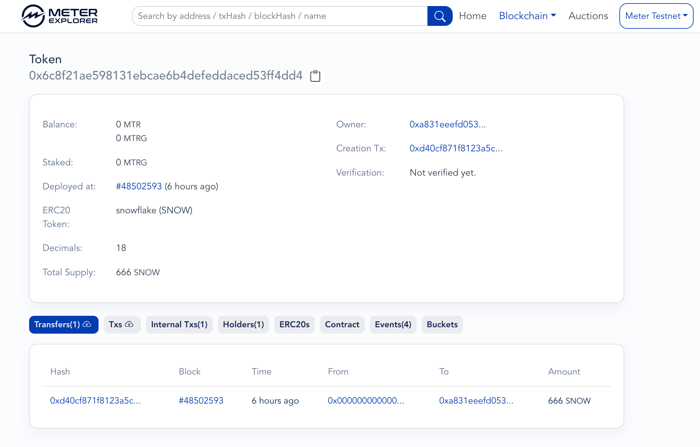

# 作业合集

## Task 1

### Deployment process

```bash
# 1. Clone project
git clone https://github.com/meterio/tokenERC20

# 2. Install
npm install --force # Node.js v16.16.0, npm v8.11.0

# 3. Copy .env.sample to .env
cp .env.sample .env

# 4. Setting up env variables
export METER_TEST_PRIVKEY=0xa831eeEFD053bfCa2E70293E2e0DA8660fca13Fa

# 5. Compile
npm run compile

# 6. Deploy
npx hardhat deploy 
  --name snowflake 
  --symbol SNOW 
  --supply 666000000000000000000 
  --owner 0xa831eeEFD053bfCa2E70293E2e0DA8660fca13Fa 
  --network metertest
```

🎉 Deployment success 



### Transaction Detail 

[METER EXPLORER](https://scan-warringstakes.meter.io/tx/0xd40cf871f8123a5c68f2cc91fdbadcf6cd9582dc50409350fe23278edff0d5f5)



### Token

[Token](https://scan-warringstakes.meter.io/address/0x6c8f21ae598131ebcae6b4defeddaced53ff4dd4)



### References

- [Meter Blockchain Explorer](https://scan-warringstakes.meter.io/)
- [Meter Docs](https://docs.meter.io/)
- [MTR token on Testnet](https://faucet-warringstakes.meter.io/)
- [tokenERC20](https://github.com/meterio/tokenERC20)
- [ChainList](https://chainlist.org/)