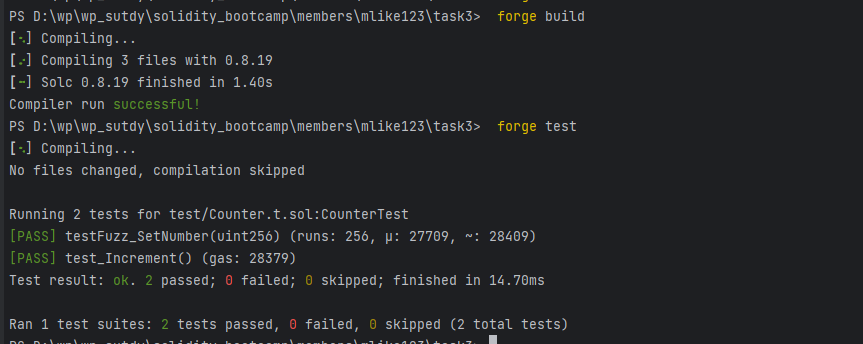

**# 个人介绍**

Github: https://github.com/mlike123

Wechat ID: yuuhh6

Wechat Name: mk

Discord ID: tonghua123

钱包地址: 0x3faBfc05EFecB6E33193D2F8d28f2046EbAB1D99

```markdown
1. about me
web3 爱好者
```

https://explorer.goerli.linea.build/address/0xfe7513e21f308901013BE9286f68E707436732de

**## 作业提交**

[任务 1 - 区块链开发例子-部署一个ERC20代币]
https://explorer.goerli.linea.build/tx/0xff70e917376e3c50521939823e8894c35fce161a9c8631218319950c1ff84b7f

[任务 2 - 发行一个ERC721的NFT合约]
https://sepolia.etherscan.io/tx/0x208847a6a8d33a12c9b61b292afe3dec9a3792cc8a2be7946212505ec5ff8bca

[任务 3 - 使用foundry框架编译和测试]

