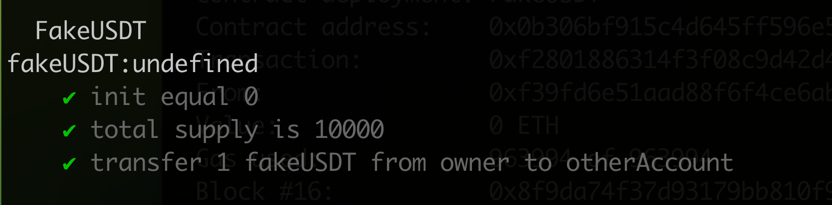

# 任务描述

使用hardhat部署一个ERC20代币

**实现方式**

直接使用`openzeppelin`提供的ERC20抽象合约实现。

[合约代码](contracts/FakeUSDT.sol)
[测试代码](test/FakeUSDT.js)

[部署脚本](scripts/deploy.js)

合约部署(网络sepolia)

```
npx hardhat run scripts/deploy.js --network sepolia
```

部署结果([链上查询](https://sepolia.etherscan.io/address/0x6C0339c71FFf8f1FF0629AC763782295040c9f3E))

```
fakeUSDT address: 0x6C0339c71FFf8f1FF0629AC763782295040c9f3E
```
