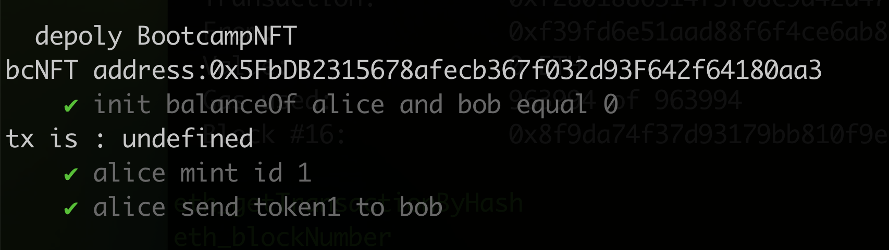

# 任务描述

发行一个ERC721的NFT合约

**实现方式**

直接使用`openzeppelin`提供的ERC721抽象合约实现。

[合约代码](contracts/BootcampNFT.sol)
[测试代码](test/BootcampNFT.js)

[部署脚本](scripts/deploy_nft.js)

合约部署(网络sepolia)

```
npx hardhat run scripts/deploy_nft.js --network sepolia
```

部署结果([链上查询](https://sepolia.etherscan.io/address/0x9ab6076ff428634e7433afc0b3e6ed7ea5a494c6))

```
bootcampNFT address: 0x9AB6076Ff428634E7433AFc0b3E6eD7Ea5A494c6
```
