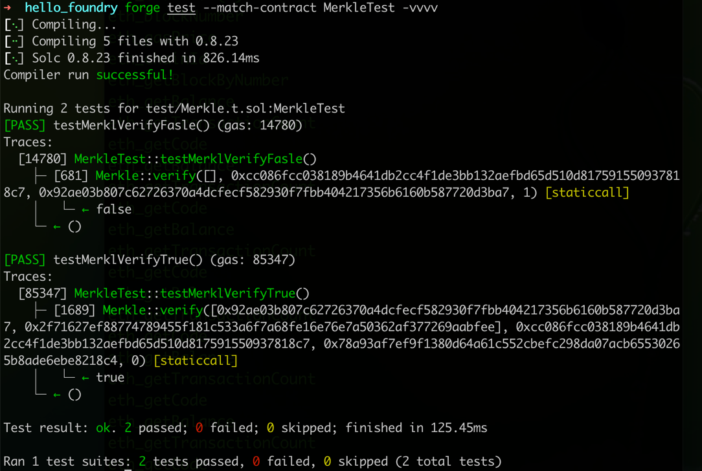

# 任务描述
使用foundry框架编译和测试

**简版Merker树实现和测试**
merker树示例
```


                             0xcc086fcc038189b4...
                                        |
                |---------------------------------------------|
        0x995788ffc103b987...                        0x2f71627ef8877478...
                |                                             |
    |-----------------------|                       |--------------------|  
0x78a93af7ef9f1380.... 0x92ae03b807c62726... 0xdca3326ad7e8121b... 0xdca3326ad7e8121b...
```
[合约代码](src/Merkle.sol)

[测试代码](test/Merkle.t.sol)



[部署脚本](scripts/Merkle.s.sol)

部署命令
`forge create Merkle --private-key 0xxxx --rpc-url https://sepolia.infura.io/v3/xxx
`

部署结果([链上查询](https://sepolia.etherscan.io/address/0xa6ae931dea82dc3620ae62d95669f8aea79efe4a))

`Deployer: 0x3E1C2514810cE662dFdE8f6E0F59432c85BEb2c5
Deployed to: 0xA6Ae931DEa82DC3620ae62D95669f8AEA79efe4A
Transaction hash: 0xcf1657bdc1d5e5e926c2b3992bf2c9d9b3310921aaac48ed92fe6bd18b815816`
