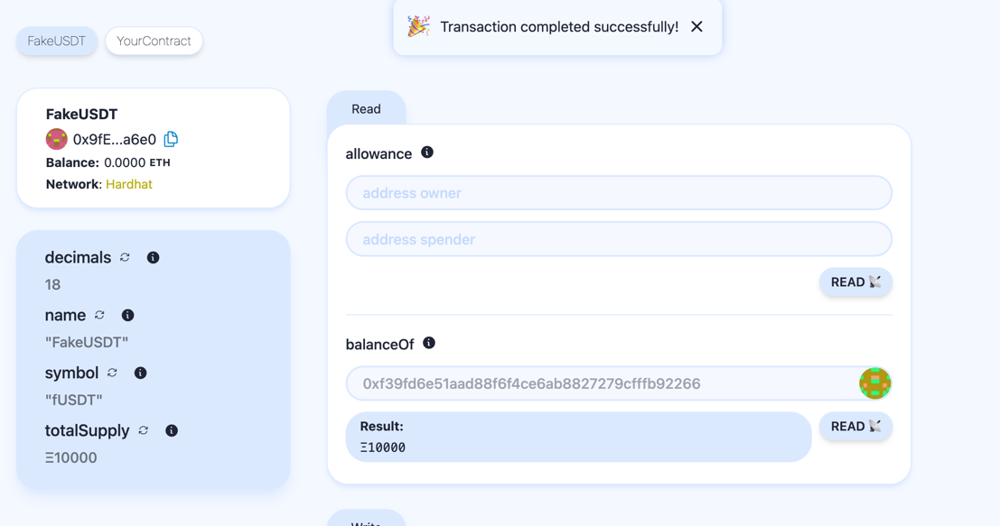
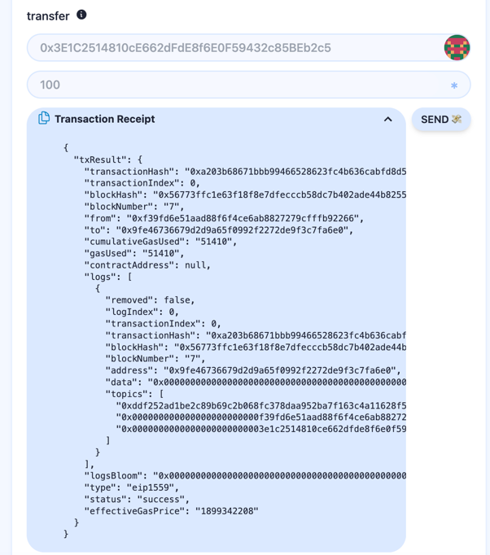

# 任务描述

查看wagmi文档和rainbow源码，根据官方例子自定义编写一个钱包 UI

**实现方式**

使用集成了wagmi、rainbow和viem的scaffold-eth-2模版，部署了[Task1](../Task1/Task1.md)的FakeUSDT合约，实现token信息的读取和transfer/appove等功能。

**页面展示**





**部署步骤**

1. Clone this repo & install dependencies

```
git clone https://github.com/scaffold-eth/scaffold-eth-2.git
cd scaffold-eth-2
yarn install
```

2. Run a local network in the first terminal:

```
yarn chain
```

3. On a second terminal, deploy FakeUSDT contract:

* 3.1  copy FakeUSDT.sol to packages/hardhat/contracts,del YourContract.sol
* 3.2  modify deploy scripts

  * replace all YourContract to FakeUSDT
  * remove Contract constructor arguments at line 27
* 3.3  add openzeppelin

  ``npm install @openzeppelin/contracts``

```
yarn deploy 
```

4. On a third terminal, start your NextJS app:

```
yarn start
```

Visit your app on: `http://localhost:3000`.
