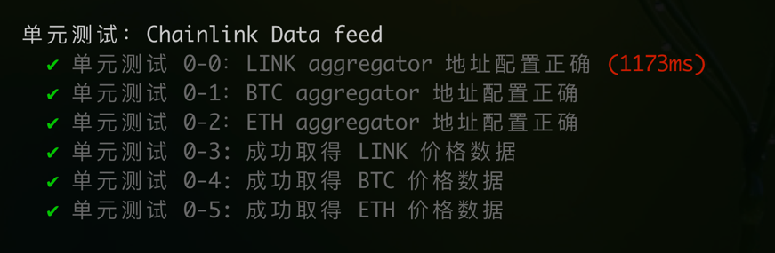
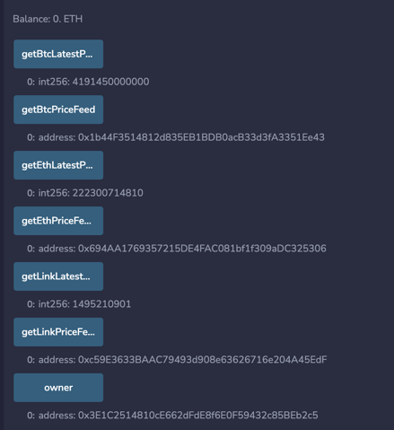

# 任务描述

任务 1 - Chainlink Data Feed

学习下述学习资料中的 Chainlink Data Feed（喂价）部分内容。

完成 contracts/DataFeedTask.sol 中的任务。

[合约代码](contracts/DataFeedTask.sol)
测试结果


sepolia链部署结果([链上查询](https://sepolia.etherscan.io/address/0x6285efd64AEdDa5942Da28133E3ed9c825dfA5f3))

```
DataFeedTask address: 0x6285efd64AEdDa5942Da28133E3ed9c825dfA5f3
```

