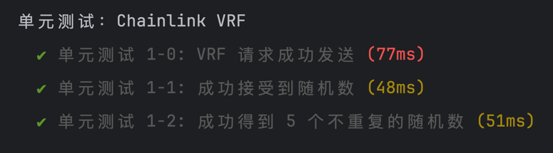
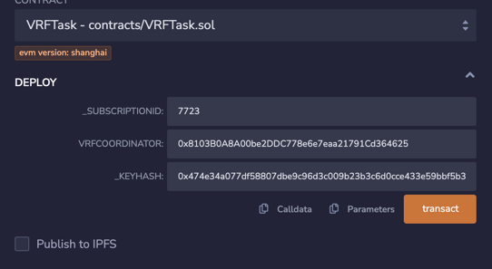
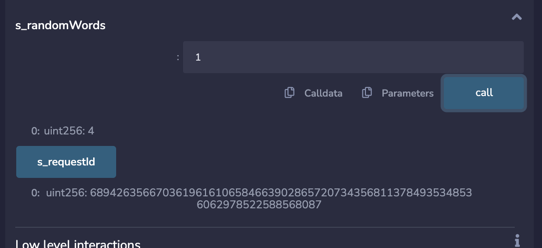

# 任务描述

任务 2 - Chainlink VRF：

学习下述学习资料的 Chainlink VRF（可验证随机数）部分内容。

完成 contracts/VRFTask.sol 中的任务。

[合约代码](contracts/VRFTask.sol)
测试结果


sepolia链部署结果([链上查询](https://sepolia.etherscan.io/address/0xb1d2a2bc85a90e12debf104340ebfc998d0a0b43))

```
VRFTask address: 0xb1d2a2bc85a90e12debf104340ebfc998d0a0b43
```

部署步骤
1. 访问[vrf](https://vrf.chain.link/) 注册订阅id
2. 部署合约，sepolia链参数如下：
   
3. [vrf](https://vrf.chain.link/)上Add Consumers，添加合约地址
4. [vrf](https://vrf.chain.link/)上充值Add funds (LINK)
5. 合约执行requestRandomWords()方法请求随机值
6. 等待5个块后，关注[VRFCOORDINATOR](https://sepolia.etherscan.io/address/0x8103b0a8a00be2ddc778e6e7eaa21791cd364625)的交易记录中Fulfill Random Words方法，查看是否是回调自己的requestid。[交易hash](https://sepolia.etherscan.io/tx/0x1600854e0cf7c3c48e0274d1395e5321c3840a1e8c9b078d43d5d8aac9863f86#eventlog)
7. 查询合约s_randomWords(uint)获得随机数组。

