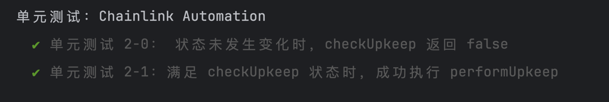

# 任务描述

任务 3 - Chainlink Automation

学习下述学习资料中的 Chainlink Automation（合约自动化执行）部分内容。

完成 contracts/AutomationTask.sol 中的任务。

[合约代码](contracts/AutomationTask.sol)

测试结果



sepolia链部署结果([链上查询](https://sepolia.etherscan.io/address/0x8f005261afab4b81ca39924e1cdb8cfa28f1f68d))

```
AutomationTask address: 0x8F005261aFaB4b81cA39924e1CDB8CFA28f1F68D
```

部署步骤
1. 部署AutomationTask合约。
2. 访问[automation官网](https://automation.chain.link/) Register new Upkeep，填入合约地址，选择“Custom logic”方式。
3. 点击Fund upkeep, 转入一些测试币。
4. 执行fight(unit)方法，将某个用户健康值-100。
5. 等待自动逻辑触发performUpkeep方法，将用户健康值回血。[交易hash](https://sepolia.etherscan.io/tx/0xf4f300909d65dc750e4ca8f16d04a7a28dce61f8720dca953b5aba363612b41e#eventlog)
6. 检查healthPoint值，已经恢复到1000了。