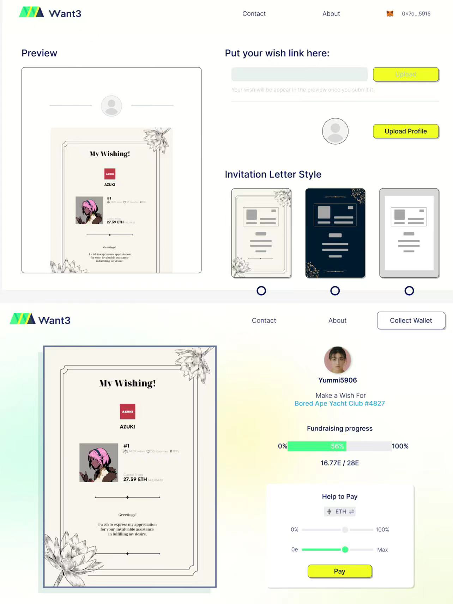

# Want-3 Mini Hackerhouse

**1 项目名称：** Want3

**2 项目赛道：** Public Goods

**3 项目图片：**

**4 简介：**

Want3 是一个 public goods 工具，服务于解决 ETH 生态上的帮人代支付的问题。每个人都可以在我们平台上发布自己的愿望，并且发送分享给其他人，鼓励他们参与完成这一愿望，并且将完成愿望对证明上链，我们工具应用的场景有很多，比如 Web3 支付宝亲情付、众筹生日礼物、结婚份子钱。我们除了开发帮人代支付的工具外，着重于主播粉丝经济赛道，致力于帮助 KOL，尤其是女生主播，完成礼物清单，帮助每一位舔狗记录那些年你舔过的女孩，用财力证明谁才是真正的榜一大哥，用你的财力证明你爱她的浓度。KOL 可以把礼物清单发给自己的 followers，如果 followers 实现愿望，还可以获得 KOL 的一些福利，比如拉进群聊，或者线下的交流等。我们目前只是一个支付工具，未来我们可以朝 ETH 生态下的直播平台、Onlyfans、Friend.Tech 发展。

**5 项目成员：**

- [Welles](https://github.com/CSWellesSun)
- [Pollo](https://github.com/arespollo)
- [李裕峰](https://github.com/licncnn)
- [Ryan🦄.eth](https://github.com/RyanFcr)
- [0xLayman](https://github.com/Laymanxu)
- 等

**6 本次黑客松的目标：**

目标：

希望做出一个好的 public goods，同时我们想尽可能让我们的工具的使用场景更有意思一点，希望大家玩起来，最后希望能够冲击一下奖项。

**7 黑客松前两日的进度：**

- Day1：
  - brainstorm 我们的 idea，确定了 Idea，然后拆解了项目工程上的框架，init project
  - 产品撰写 user journey 并且开始设计 UIUX
  - 后端同步写基本的框架
- Day2：
  - 根据 UI 开始实现前端逻辑
  - 录制 Demo
  - Deck

**8 Demo 视频链接：**

https://k5ms77k0o1.feishu.cn/docx/FeLhdyhSSokVcbx6ECxcpAdBn6d?from=from_copylink

**9 项目 Github Repo：**

详见projects文件夹

**10 声明：**

项目是团队从 0 到 1 开发的项目，完全原创。

**11 Demo 链接：**

https://want3.zeabur.app/

在线部署：

我们的部署使用了 zeabur 的在线部署服务，前端react和后端express都部署在zeabur上，只需要将frontend和backend的仓库绑定即可自动部署，其中需要使用到在线的数据库，我们使用的是 Mongodb Atlas，用户需要设置一下 MONGODB_URL 和JWT_SECRET 这两个环境变量即可使用。

本地部署：

本地部署即正常地前后端部署流程，其中后端需要将 .env.example 改名为 .env 并设置好上述 MONGODB_URL 和 JWT_SECRET 两个环境变量。

**12 Deck：**

https://gamma.app/docs/Want3-If-you-want-it-Ill-surprise-you-0el4d90gqfpwbve
